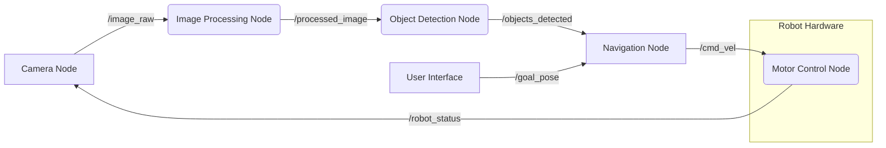

# ROS 2 Architecture: The Robotics Graph

ROS 2 is built upon a distributed, graph-based architecture that enables flexible and scalable robot software development. Understanding this architecture is fundamental to effectively using ROS 2 for any robotics project, especially for complex systems like humanoids.

## The ROS 2 Graph

At the heart of ROS 2 is the **ROS 2 graph**, a network of communicating processes. These processes, called **nodes**, perform specific tasks and interact with each other by sending and receiving messages. The graph defines the runtime communication structure of your robot application.

### Key Concepts of the ROS 2 Graph:

*   **Nodes:** Executable units in ROS 2 that perform computation. A robot system typically consists of many nodes, each responsible for a specific function (e.g., a camera driver node, a motion planning node, a motor control node).
*   **Topics:** Named buses over which nodes exchange messages. Topics provide a publish/subscribe communication model, meaning a node can publish data to a topic, and any number of other nodes can subscribe to that topic to receive the data. This is ideal for continuous data streams like sensor readings or motor commands.
*   **Services:** Provide a request/response communication model. A service allows a node to offer a specific functionality (the server) that other nodes (the clients) can call, wait for a result, and receive a response. This is suitable for operations that have a clear start and end, like triggering a robot arm movement or requesting a map update.
*   **Actions:** Extend the service concept for long-running tasks. An action involves a goal, feedback, and a result. A client sends a goal, receives continuous feedback on the progress of the task, and eventually gets a final result. This is perfect for tasks like navigating to a goal location, where progress updates are important.
*   **Parameters:** Dynamic, runtime configurable values for nodes. Parameters allow you to adjust a node's behavior without recompiling the code, such as changing a PID gain for a motor controller or modifying a threshold for a sensor filter.
*   **Messages:** Data structures used for communication between nodes over topics, services, and actions. ROS 2 provides a rich set of standard message types, and you can also define custom messages.

## Data Distribution Service (DDS)

Unlike ROS 1, which used its own communication layer (ROS-RPC), ROS 2 leverages **Data Distribution Service (DDS)** as its primary communication middleware. DDS is an open international standard for real-time systems that offers:

*   **Discovery:** Automatically finds other ROS 2 entities (nodes, topics, services) in the network.
*   **Reliability:** Ensures message delivery, even in unreliable networks.
*   **Quality of Service (QoS):** Allows fine-grained control over communication parameters like reliability, durability, and latency. This is critical for meeting the diverse requirements of different robotic components (e.g., a high-frequency IMU needs different QoS than a low-frequency status update).
*   **Security:** Provides mechanisms for authentication, encryption, and access control.
*   **Platform Independence:** DDS implementations are available for various operating systems and programming languages.

This choice of DDS gives ROS 2 significant advantages in terms of real-time performance, distributed deployment, and enterprise-grade capabilities, making it more robust for demanding applications like humanoid robotics.

## Visualizing the ROS 2 Graph

Tools like `rqt_graph` allow you to visualize the runtime ROS 2 graph, showing the active nodes and their connections via topics and services. This is invaluable for debugging and understanding the data flow in your robot system.

*Figure 1.1: A simplified ROS 2 graph illustrating communication between various nodes.*

## Checkpoint

*   What are the main components of the ROS 2 graph?
*   How does DDS improve ROS 2 compared to ROS 1?
*   Why is modularity important for humanoid robot software?

By grasping these architectural concepts, you are well-prepared to dive into the practical implementation of ROS 2 communication patterns in the next chapter.
