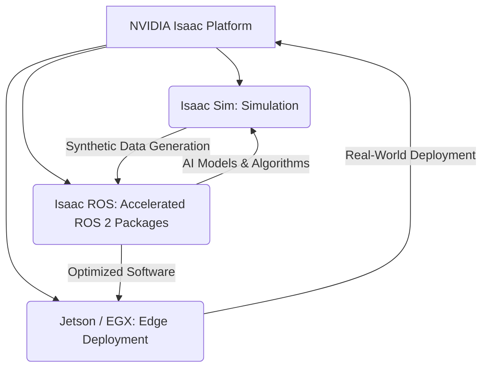

# Introduction to NVIDIA Isaac Platform

Welcome to Module 3: NVIDIA Isaac Platform. As physical AI and humanoid robotics advance, the demand for powerful simulation, accelerated AI development, and seamless deployment on specialized hardware grows. NVIDIA's Isaac Platform is a comprehensive suite of tools and SDKs designed to meet these needs, providing a unified framework for robotics development, from simulation to real-world deployment.

## What is the NVIDIA Isaac Platform?

The NVIDIA Isaac Platform is an end-to-end robotics development solution built on NVIDIA's Omniverse platform. It leverages NVIDIA GPUs and AI software to accelerate every stage of the robotics lifecycle:

*   **Simulation:** High-fidelity, physically accurate simulation environments for rapid development and testing.
*   **AI Development:** Tools and libraries optimized for training and deploying AI models for robotics tasks like perception, manipulation, and navigation.
*   **Hardware Acceleration:** Optimized software stacks to run AI and robotics applications efficiently on NVIDIA Jetson edge devices and other GPU-accelerated platforms.
*   **ROS 2 Integration:** Deep integration with ROS 2, allowing developers to leverage the ROS 2 ecosystem while benefiting from NVIDIA's acceleration.

## Why NVIDIA Isaac for Physical AI and Humanoid Robotics?

For complex physical AI systems and humanoids, the Isaac Platform offers significant advantages:

*   **Realistic Simulation (Isaac Sim):** Develop and test advanced locomotion, manipulation, and human-robot interaction in a virtual world that closely mirrors reality, reducing the need for expensive physical prototypes.
*   **Accelerated AI (Isaac ROS):** Utilize GPU-acceleraccelerated ROS 2 packages for perception (e.g., stereo matching, object detection), navigation (e.g., Nav2), and manipulation, significantly speeding up AI inference.
*   **Scalability:** Develop solutions that scale from single robots to large fleets, benefiting from consistent tools across simulation and deployment.
*   **Developer Ecosystem:** Access to a rich set of tutorials, examples, and community support.

*Figure: Overview of the NVIDIA Isaac Platform's integrated approach.*

## Core Components of Isaac Platform

This module will focus on two primary components:

1.  **Isaac Sim:** A robotics simulation and synthetic data generation platform built on NVIDIA Omniverse. It enables the creation of highly realistic virtual environments and the training of AI models using synthetic data.
2.  **Isaac ROS:** A collection of hardware-accelerated ROS 2 packages that leverage NVIDIA GPUs to improve performance for perception, navigation, and manipulation algorithms.

By the end of this module, you will understand how to utilize NVIDIA Isaac tools to accelerate the development, testing, and deployment of physical AI and humanoid robotic systems, pushing the boundaries of what's possible in embodied intelligence.

## Exercises

1.  Describe the main advantage of using NVIDIA Isaac Platform for robotics development compared to using separate simulation and AI tools.
2.  Explain how Isaac Sim and Isaac ROS complement each other within the Isaac Platform ecosystem.
3.  Why is hardware acceleration particularly important for AI algorithms in physical AI and humanoid robotics?