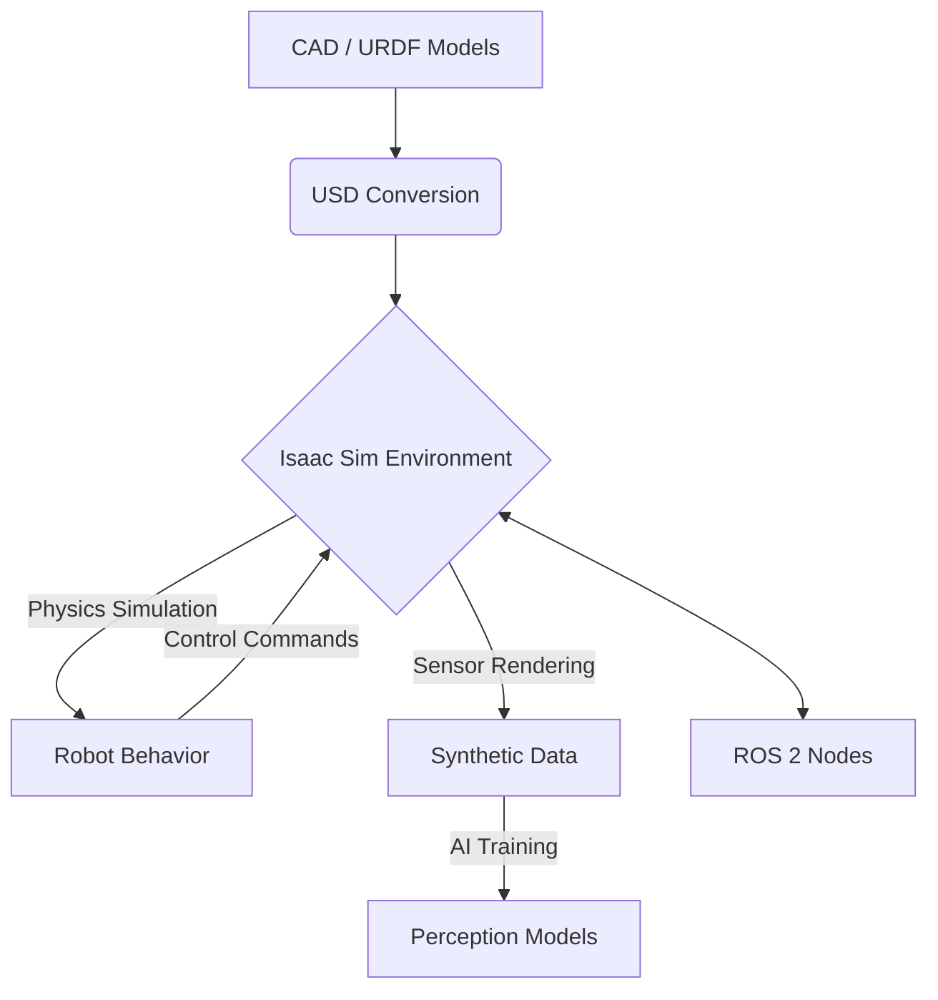

# NVIDIA Isaac Sim for High-Fidelity Simulation

NVIDIA Isaac Sim is a powerful, robotics simulation and synthetic data generation platform built on NVIDIA Omniverse. It offers a highly realistic, physically accurate, and scalable environment for developing, testing, and training AI-powered robots, particularly crucial for complex systems like humanoids. Isaac Sim leverages Universal Scene Description (USD) for its scene representation, enabling rich, collaborative, and interoperable 3D workflows.

## Key Features of Isaac Sim

*   **Physically Accurate Simulation:** Utilizes NVIDIA PhysX 5.0 for realistic rigid body dynamics, fluid dynamics, soft body physics, and particle simulations.
*   **High-Fidelity Rendering:** Powered by NVIDIA RTX technology, providing photorealistic rendering that is essential for training computer vision models with synthetic data.
*   **Synthetic Data Generation (SDG):** Tools to automatically generate vast amounts of labeled data (e.g., RGB, depth, segmentation, bounding boxes) with randomized parameters, addressing the limitations of real-world data collection.
*   **ROS 2 & Omnigraph Integration:** Deep integration with ROS 2 allows seamless communication between Isaac Sim and ROS 2 nodes. Omnigraph provides a node-based visual scripting interface for building complex simulation logic.
*   **USD (Universal Scene Description):** A powerful, open-source 3D scene description technology developed by Pixar, used as the foundational scene representation in Omniverse. USD enables a non-destructive workflow, allowing multiple users to collaborate on the same scene.

## Simulation Workflow in Isaac Sim

1.  **Scene Construction:** Create or import 3D environments and robot models (e.g., URDF, USD) into Isaac Sim.
2.  **Robot Definition:** Define robot kinematics, dynamics, and actuators. For humanoids, this involves precise joint and link configurations.
3.  **Sensor Configuration:** Add and configure virtual sensors (cameras, LiDAR, IMUs) to mimic real-world counterparts, including noise models.
4.  **Behavior Scripting (Python/Omnigraph):** Program robot behaviors, task logic, and generate synthetic data using Python scripts or Omnigraph visual scripting.
5.  **ROS 2 Interfacing:** Establish communication with external ROS 2 nodes for control, perception, and data exchange.


*Figure: Isaac Sim simulation and synthetic data generation pipeline.*

## Basic Isaac Sim Python Script Example

Isaac Sim simulations are often controlled via Python scripts, leveraging the `omni.isaac.core` and `omni.isaac.robot` APIs.

Here's a conceptual Python script to load a simple humanoid-like robot and make it stand upright:

```python
# my_isaac_sim_project/scripts/load_humanoid.py

from omni.isaac.kit import SimulationApp

# Launch the kit simulation app
kit = SimulationApp({"headless": False})

from omni.isaac.core import World
from omni.isaac.core.articulations import ArticulationView
from omni.isaac.core.utils.nucleus import get_assets_root_path
from omni.isaac.core.utils.stage import add_reference_to_stage
import numpy as np
import carb

class HumanoidStandApp:
    def __init__(self):
        self.world = World(stage_units_in_meters=1.0)
        self.world.scene.add_default_ground_plane()

        # Load a simple humanoid robot (replace with actual USD path)
        assets_root_path = get_assets_root_path()
        if assets_root_path is None:
            carb.log_error("Could not find Isaac Sim assets folder")
            kit.close()
            exit()

        # Example: Referencing a simplified humanoid model (replace with your USD)
        # A full humanoid USD would be more complex
        humanoid_asset_path = assets_root_path + "/Isaac/Robots/Humanoid/franka_humanoid.usd" # This is a placeholder path
        add_reference_to_stage(humanoid_asset_path, "/World/Humanoid")

        self.world.reset()
        self.humanoid = ArticulationView(prim_paths_pattern="/World/Humanoid", name="humanoid_robot_view")
        self.world.scene.add(self.humanoid)
        self.world.reset()

        # Target joint positions for standing (conceptual)
        # This would be highly specific to the humanoid model and its joint configuration
        self.standing_joint_positions = np.array([0.0] * self.humanoid.num_dof)
        # example: for a humanoid, specific joint angles would be set for knees, hips, etc. to achieve standing

    def run(self):
        self.world.run_physics()
        self.world.step(render=True)

        # Set joint positions to achieve standing posture
        # In a real scenario, this would be a control loop with PID or Inverse Kinematics
        if self.world.is_paused():
            self.humanoid.set_joint_positions(self.standing_joint_positions)
            print("Humanoid set to standing posture.")

        # Keep the simulation running
        while kit.is_running():
            self.world.step(render=True)

# Run the app
app = HumanoidStandApp()
app.run()

kit.close()
```

*(Note: The `humanoid_asset_path` and `standing_joint_positions` in the example are conceptual. A real humanoid model in Isaac Sim would require a specifically designed USD file and corresponding joint control logic.)*

## Exercises

1.  Explain how Synthetic Data Generation (SDG) in Isaac Sim can address the challenges of data scarcity and diversity for training AI models in robotics.
2.  Describe the role of Universal Scene Description (USD) in Isaac Sim and how it benefits collaborative robotics development.
3.  Outline the high-level steps you would take in Isaac Sim to simulate a humanoid robot performing a pick-and-place task. What components of Isaac Sim would be most relevant for this task?