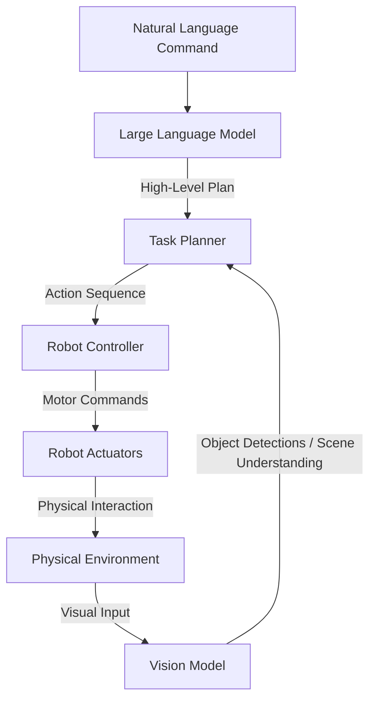

# Introduction to Vision-Language-Action (VLA) Robotics

Welcome to Module 4: Vision-Language-Action (VLA) Robotics. This is a cutting-edge field at the intersection of computer vision, natural language processing, and robot control, aiming to create robots that can understand human instructions in natural language, perceive the world through visual input, and perform complex physical actions. VLA robotics is crucial for achieving truly intelligent and intuitive human-robot interaction, especially for humanoids operating in unstructured environments.

## The Promise of VLA Robotics

Traditional robotics often requires explicit programming for every task, limiting adaptability. VLA robotics seeks to overcome this by enabling robots to:

*   **Understand High-Level Commands:** Interpret natural language instructions (e.g., "Please tidy up the living room") and break them down into executable sub-tasks.
*   **Perceive and Localize:** Use visual and other sensory data to understand the environment, identify objects, and their states.
*   **Reason and Plan:** Generate sequences of actions to achieve goals, adapting to unexpected situations and dynamic environments.
*   **Execute Physical Actions:** Control robot manipulators, grippers, and locomotion systems to interact with objects and navigate the world.

This convergence allows for a more human-friendly way of interacting with robots, moving from complex coding to intuitive conversation.

## Core Components of VLA Systems

1.  **Vision Models:** Advanced computer vision techniques (e.g., object detection, segmentation, pose estimation) to extract meaningful information from camera feeds.
2.  **Language Models (LLMs):** Large Language Models are used for natural language understanding (NLU) to interpret human commands, and for natural language generation (NLG) to communicate back to humans.
3.  **Action / Policy Learning:** Robotics control policies that translate high-level plans into low-level motor commands for the robot's actuators.
4.  **Embodied Reasoning:** The ability to reason about the physical world, incorporating concepts like physics, affordances (what an object can be used for), and common-sense knowledge.

*Figure: Simplified Architecture of a Vision-Language-Action Robotics System.*

## VLA for Humanoid Robotics

Humanoid robots are a natural fit for VLA capabilities because they are designed to operate in human environments and often need to perform human-like tasks. VLA allows humanoids to:

*   **Respond to Vocal Commands:** Understand and execute instructions given verbally.
*   **Learn from Demonstrations:** Observe human actions and infer tasks.
*   **Manipulate Diverse Objects:** Use vision and language to identify and interact with objects in a generalizable way.
*   **Explain Intent:** Communicate their plans and reasoning to human collaborators.

## Module Overview

In this module, we will explore:

1.  **Whisper and Voice-to-Action:** How speech recognition converts human speech into text commands.
2.  **LLM Planning:** Leveraging LLMs for high-level task planning and decomposition.
3.  **Multimodal Robotics:** The integration of various sensory modalities (vision, touch, audio) with language for comprehensive world understanding.

By the end of this module, you will understand the principles behind VLA robotics and how to integrate powerful AI models to enable more intelligent and intuitive humanoid robot behaviors.

## Exercises

1.  Explain how a VLA robotics system might interpret the command, "Grab the red mug from the table." Detail the role of vision and language components.
2.  What are the primary advantages of using large language models (LLMs) in robotics for task planning, compared to traditional symbolic planners?
3.  Discuss the concept of "embodied reasoning" in VLA robotics. Why is it important for a robot to reason about the physical world?