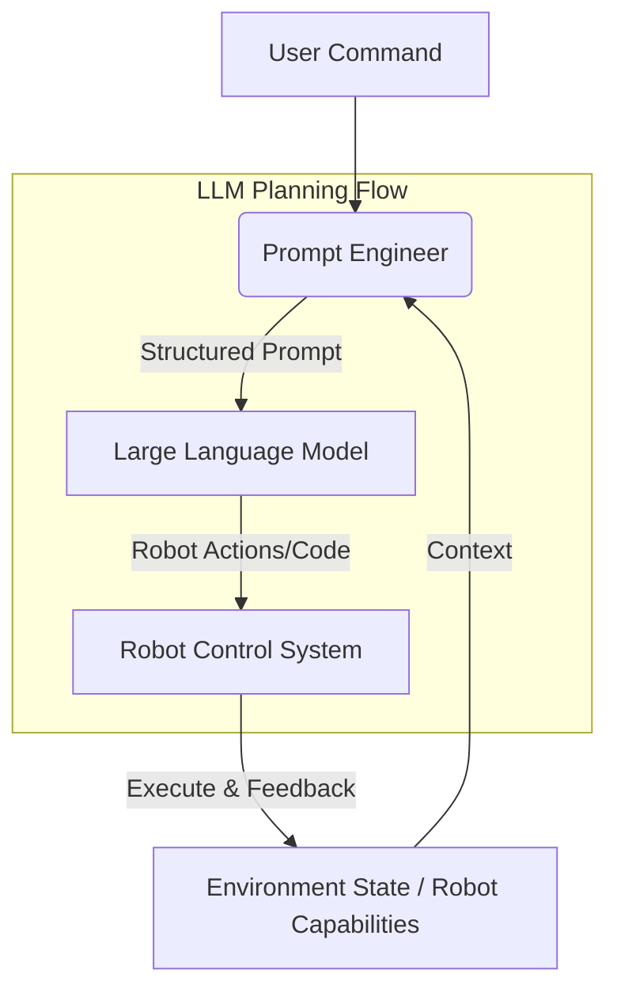

# LLM-Driven Task Planning for Robotics

One of the most exciting advancements in Vision-Language-Action (VLA) robotics is the use of Large Language Models (LLMs) for high-level task planning. Instead of meticulously programming every robot action, LLMs can interpret human commands, reason about the environment, and generate executable plans or even code snippets for robots. This greatly enhances a robot's flexibility and ability to handle novel situations.

## The Role of LLMs in Robot Planning

LLMs bring powerful capabilities to robotics planning:

*   **Natural Language Understanding:** Translate human intentions from free-form text or speech into structured robot goals.
*   **Common-Sense Reasoning:** Leverage vast knowledge acquired during training to infer plausible actions, object properties, and environmental dynamics.
*   **Task Decomposition:** Break down complex, abstract goals (e.g., "make coffee") into a series of smaller, actionable sub-tasks (e.g., "pick up mug," "fill with water," "brew").
*   **Error Recovery:** Suggest alternative plans or diagnose issues when a primary plan fails.
*   **Code Generation:** In some advanced systems, LLMs can even generate low-level control code or script sequences for the robot.

## Prompt Engineering for Robot Control

The effectiveness of LLM-driven planning heavily relies on **prompt engineering**—crafting precise and informative prompts to guide the LLM's output. A good prompt for robotics typically includes:

*   **System Role:** Define the LLM's role (e.g., "You are a robot task planner.").
*   **Available Tools/Actions:** List the specific robot capabilities or API functions the LLM can call.
*   **Environmental Context:** Provide information about the robot's current state and the observed environment (e.g., "Objects: red mug, blue plate, coffee machine.").
*   **User Goal:** The natural language instruction from the human.
*   **Output Format:** Specify the desired output format (e.g., JSON, Python list of actions, code).


*Figure: LLM-driven task planning pipeline.*

## Task Decomposition Example

Consider the command: "Clean up the table."

An LLM might decompose this into:

1.  Identify all clutter on the table.
2.  For each item:
    a.  Determine its designated storage location.
    b.  Grasp the item.
    c.  Navigate to the storage location.
    d.  Place the item.
3.  Wipe down the table surface.

The LLM needs to know the robot's capabilities (e.g., "can grasp," "can navigate," "can wipe") and environmental facts (e.g., "where is the red mug stored?") to perform this decomposition.

## LLM as a Code Generator for Robotics

Beyond just generating action sequences, advanced LLMs can directly generate executable code for robotics platforms. This could range from Python scripts for ROS 2 nodes to domain-specific language (DSL) commands.

### Python Example (Conceptual LLM Output)

Given the command "Pick up the apple and put it in the basket,"
An LLM might output a plan in a structured format, which a separate execution module then converts into robot commands:

```python
# Conceptual Python output from LLM for a robotics task

[
    {"action": "navigate", "target": "apple"},
    {"action": "perceive", "object": "apple", "sensor_type": "camera_rgb"},
    {"action": "grasp", "object_id": "apple_id", "grasp_pose": [x, y, z, qx, qy, qz, qw]},
    {"action": "navigate", "target": "basket"},
    {"action": "place", "object_id": "apple_id", "place_pose": [x, y, z, qx, qy, qz, qw]}
]
```

Each of these dictionary entries would then be handled by a dedicated robot skill or low-level controller.

## Challenges and Future Directions

Despite the power of LLMs, challenges remain:

*   **Grounding:** Ensuring LLM plans are physically feasible and grounded in the real world.
*   **Safety:** Preventing LLMs from generating unsafe or destructive actions.
*   **Efficiency:** Running large LLMs on edge devices or in real-time control loops.
*   **Long-Horizon Planning:** Maintaining coherence for tasks spanning many steps.

Future research focuses on integrating LLMs more deeply with perception and control, creating robust feedback loops, and developing smaller, more efficient LLM architectures tailored for robotics.

## Exercises

1.  Design a prompt (including system role, tools, context, and desired output format) that would instruct an LLM to plan a simple cooking task for a humanoid robot, such as "slice the cucumber."
2.  Discuss the trade-offs between an LLM generating a high-level action sequence versus generating low-level executable code for a robot. When would you prefer one over the other?
3.  How can real-time visual feedback from the robot's cameras be used to improve the robustness and adaptability of an LLM-driven planning system?