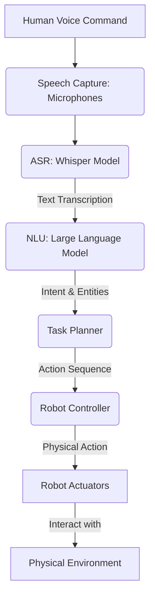

# Whisper and Voice-to-Action for Robotics

In Vision-Language-Action (VLA) robotics, the ability for a robot to understand spoken human commands is a crucial interface. This is where advanced Automatic Speech Recognition (ASR) models like OpenAI's Whisper play a pivotal role. Whisper, trained on a massive dataset of diverse audio, can accurately transcribe human speech into text, which can then be processed by Large Language Models (LLMs) for task planning and execution in robots.

## The Voice-to-Action Pipeline

The process of converting a spoken command into a robot action typically involves several stages:

1.  **Speech Capture:** The robot's microphones capture audio from the environment.
2.  **Speech-to-Text (ASR):** An ASR model (e.g., Whisper) transcribes the audio into a written text command.
3.  **Natural Language Understanding (NLU):** An LLM or a specialized NLU module parses the text command to extract intent, entities (e.g., objects, locations), and constraints.
4.  **Task Planning:** Based on the extracted intent, the robot's planner generates a sequence of actions.
5.  **Action Execution:** The robot's control systems execute the planned actions in the physical world.


*Figure: The voice-to-action pipeline for LLM-driven robots.*

## OpenAI's Whisper for ASR

Whisper is a general-purpose speech recognition model. It is trained on a large dataset of audio and corresponding transcripts, making it robust to various accents, background noise, and technical language. Its ability to handle multiple languages and perform accurate transcription makes it an excellent choice for robotics applications where clear communication is essential.

### Using Whisper (Python Example)

To use Whisper, you typically install it via `pip`:

```bash
pip install openai-whisper
```

Then, you can use it in a Python script to transcribe audio:

```python
# my_robot_speech_pkg/scripts/whisper_transcriber.py

import whisper
import pyaudio
import wave
import rclpy
from rclpy.node import Node
from std_msgs.msg import String

# --- Audio Recording Configuration ---
CHUNK = 1024
FORMAT = pyaudio.paInt16
CHANNELS = 1
RATE = 16000 # Sample rate for Whisper
RECORD_SECONDS = 5 # Record for 5 seconds
OUTPUT_FILENAME = "output.wav"
# -----------------------------------

class WhisperTranscriber(Node):
    def __init__(self):
        super().__init__('whisper_transcriber')
        self.publisher_ = self.create_publisher(String, 'robot_voice_command', 10)
        self.get_logger().info('Whisper Transcriber Node initialized. Waiting for commands...')
        self.model = whisper.load_model("base") # Load a smaller model for faster inference

        # Start recording when the node is active (conceptual, in real robot might be triggered by keyword)
        self.timer = self.create_timer(10.0, self.record_and_transcribe) # Trigger every 10 seconds

    def record_audio(self):
        audio = pyaudio.PyAudio()
        stream = audio.open(format=FORMAT, channels=CHANNELS, rate=RATE, input=True, frames_per_buffer=CHUNK)
        self.get_logger().info("Recording...")
        frames = []
        for _ in range(0, int(RATE / CHUNK * RECORD_SECONDS)):
            data = stream.read(CHUNK)
            frames.append(data)
        self.get_logger().info("Finished recording.")
        stream.stop_stream()
        stream.close()
        audio.terminate()

        wf = wave.open(OUTPUT_FILENAME, 'wb')
        wf.setnchannels(CHANNELS)
        wf.setsampwidth(audio.get_sample_size(FORMAT))
        wf.setframerate(RATE)
        wf.writeframes(b''.join(frames))
        wf.close()

    def transcribe_audio(self, audio_file):
        result = self.model.transcribe(audio_file)
        return result["text"]

    def record_and_transcribe(self):
        self.record_audio()
        transcribed_text = self.transcribe_audio(OUTPUT_FILENAME)
        self.get_logger().info(f"Transcribed: \"{transcribed_text}\"")

        msg = String()
        msg.data = transcribed_text
        self.publisher_.publish(msg)

def main(args=None):
    rclpy.init(args=args)
    node = WhisperTranscriber()
    rclpy.spin(node)
    node.destroy_node()
    rclpy.shutdown()

if __name__ == '__main__':
    main()
```

*(Note: This is a simplified example. Real-world robot applications would integrate more sophisticated hot-word detection, continuous listening, and error handling. You'd also need `pyaudio` for audio input.)*

## Integrating with LLMs for NLU

Once a spoken command is transcribed into text by Whisper, it can be fed into an LLM. The LLM's role is to understand the human's intent, identify relevant objects and actions, and potentially decompose the command into a structured, robot-executable plan. This is where the power of VLA truly shines, enabling robots to respond intelligently to complex and nuanced instructions.

## Exercises

1.  Explain the importance of an accurate ASR system like Whisper in the context of VLA robotics for humanoid robots.
2.  Describe the main steps involved in converting a human's spoken command into a robot's physical action using Whisper and an LLM.
3.  Research and discuss potential challenges in deploying ASR systems on edge robotics devices (e.g., NVIDIA Jetson), considering computational resources and real-time constraints.