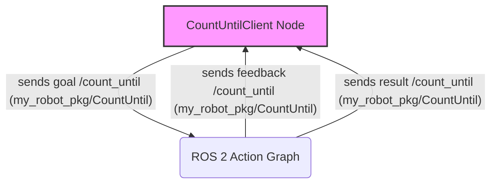

# ROS 2 Actions: Goal-Oriented, Long-Running Tasks

**Actions** in ROS 2 are designed for long-running, goal-oriented tasks that may require periodic feedback and the ability to be preempted (cancelled). They build upon the concepts of topics and services, providing a more robust communication pattern for complex operations like moving a robot to a target pose, grasping an object, or performing a lengthy computation.

## Key Characteristics

Actions consist of three main components:

*   **Goal**: The desired state or target (e.g., "move 5 meters forward").
*   **Feedback**: Periodic updates on the progress of the action (e.g., "robot has moved 2 meters").
*   **Result**: The final outcome of the action (e.g., "robot reached target").

Similar to services, actions use a defined interface (`.action` file) for goal, result, and feedback messages. They are asynchronous, allowing the client to continue processing while the action server executes the task.

## Creating a Simple ROS 2 Action (Python)

Let's create a simple action to count up to a specified number.

### 1. Define the Action Interface (`CountUntil.action`)

In your `my_robot_pkg`, create an `action` directory: `my_robot_pkg/action/`. Inside this directory, create `CountUntil.action`:

```
int64 target_number
---
int64 final_count
---
int64 current_count
```

*   The first section is the **goal** (`target_number`).
*   The second section, separated by `---`, is the **result** (`final_count`).
*   The third section, also separated by `---`, is the **feedback** (`current_count`).

### 2. Update `package.xml`

Add these lines to `my_robot_pkg/package.xml`:

```xml
  <buildtool_depend>ament_cmake</buildtool_depend>
  <buildtool_depend>rosidl_default_generators</buildtool_depend>
  <exec_depend>rosidl_default_runtime</exec_depend>
  <member_of_group>rosidl_interface_packages</member_of_group>
```

### 3. Update `CMakeLists.txt`

Edit `my_robot_pkg/CMakeLists.txt`. Add the following lines:

```cmake
find_package(rosidl_default_generators REQUIRED)

rosidl_generate_interfaces(${PROJECT_NAME}
  "action/CountUntil.action"
  "srv/AddTwoInts.srv"
)
```

### 4. Write the Action Server (`count_until_server.py`)

Inside `my_robot_pkg/my_robot_pkg/`, create `count_until_server.py`:

```python
import time
import rclpy
from rclpy.action import ActionServer
from rclpy.node import Node

from my_robot_pkg.action import CountUntil

class CountUntilActionServer(Node):

    def __init__(self):
        super().__init__('count_until_action_server')
        self._action_server = ActionServer(
            self,
            CountUntil,
            'count_until',
            self.execute_callback)
        self.get_logger().info('Count Until Action Server Ready.')

    async def execute_callback(self, goal_handle):
        self.get_logger().info(f'Executing goal: {goal_handle.request.target_number}')

        feedback_msg = CountUntil.Feedback()
        current_count = 0

        while rclpy.ok() and current_count < goal_handle.request.target_number:
            if goal_handle.is_cancel_requested:
                goal_handle.canceled()
                self.get_logger().info('Goal canceled!')
                return CountUntil.Result(final_count=current_count)

            current_count += 1
            feedback_msg.current_count = current_count
            self.get_logger().info(f'Feedback: {feedback_msg.current_count}')
            goal_handle.publish_feedback(feedback_msg)
            time.sleep(1) # Simulate work

        goal_handle.succeed()
        result = CountUntil.Result(final_count=current_count)
        self.get_logger().info(f'Goal succeeded. Final count: {result.final_count}')
        return result

def main(args=None):
    rclpy.init(args=args)
    action_server = CountUntilActionServer()
    rclpy.spin(action_server)
    action_server.destroy_node()
    rclpy.shutdown()

if __name__ == '__main__':
    main()
```

### 5. Write the Action Client (`count_until_client.py`)

Inside `my_robot_pkg/my_robot_pkg/`, create `count_until_client.py`:

```python
import sys
import rclpy
from rclpy.action import ActionClient
from rclpy.node import Node
from my_robot_pkg.action import CountUntil

class CountUntilActionClient(Node):

    def __init__(self):
        super().__init__('count_until_action_client')
        self._action_client = ActionClient(self, CountUntil, 'count_until')

    def send_goal(self, target_number):
        self.get_logger().info('Waiting for action server...')
        self._action_client.wait_for_server()

        goal_msg = CountUntil.Goal()
        goal_msg.target_number = target_number

        self.get_logger().info('Sending goal...')
        self._send_goal_future = self._action_client.send_goal_async(goal_msg,
            feedback_callback=self.feedback_callback)

        self._send_goal_future.add_done_callback(self.goal_response_callback)

    def goal_response_callback(self, future):
        goal_handle = future.result()
        if not goal_handle.accepted:
            self.get_logger().info('Goal rejected :(')
            return

        self.get_logger().info('Goal accepted :)')

        self._get_result_future = goal_handle.get_result_async()
        self._get_result_future.add_done_callback(self.get_result_callback)

    def get_result_callback(self, future):
        result = future.result().result
        status = future.result().status
        if status == 4: # GoalStatus.SUCCEEDED
            self.get_logger().info(f'Goal succeeded! Final count: {result.final_count}')
        else:
            self.get_logger().info(f'Goal failed with status: {status}')

        rclpy.shutdown()

    def feedback_callback(self, feedback_msg):
        self.get_logger().info(f'Received feedback: {feedback_msg.feedback.current_count}')

def main(args=None):
    rclpy.init(args=args)

    if len(sys.argv) != 2:
        print('Usage: ros2 run my_robot_pkg count_until_client <target_number>')
        rclpy.shutdown()
        sys.exit(1)

    action_client = CountUntilActionClient()
    action_client.send_goal(int(sys.argv[1]))

    rclpy.spin(action_client) # Keep node alive to receive feedback and result

if __name__ == '__main__':
    main()
```

### 6. Update `setup.py`

Add the new executables to `my_robot_pkg/setup.py`:

```python
    entry_points={
        'console_scripts': [
            'simple_publisher = my_robot_pkg.simple_publisher:main',
            'simple_subscriber = my_robot_pkg.simple_subscriber:main',
            'add_two_ints_server = my_robot_pkg.add_two_ints_server:main',
            'add_two_ints_client = my_robot_pkg.add_two_ints_client:main',
            'count_until_server = my_robot_pkg.count_until_server:main',
            'count_until_client = my_robot_pkg.count_until_client:main',
        ],
    },
```

### 7. Build and Source

```bash
colcon build --packages-select my_robot_pkg
source install/setup.bash
```

### 8. Run Action Server and Client

Open two terminals. In the first, run the action server:

```bash
ros2 run my_robot_pkg count_until_server
```

In the second, run the client with a target number:

```bash
ros2 run my_robot_pkg count_until_client 5
```

You should see feedback messages as the server counts and a final result message.

## Visualizing Action Communication



Actions are essential for managing complex robot behaviors that unfold over time, offering a structured way to handle goals, monitor progress, and respond to completion or cancellation. With nodes, topics, services, and actions, you have the fundamental communication tools to build sophisticated ROS 2 applications. Next, we will explore `rclpy`, the Python client library in more detail.
