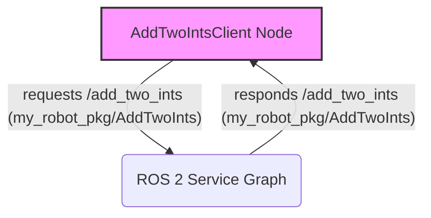

# ROS 2 Services: Synchronous Request/Response

**Services** in ROS 2 provide a synchronous request/response communication model, ideal for operations that require an immediate result or a single exchange of information between two nodes. Unlike topics, which are one-to-many and asynchronous, services are one-to-one and block until a response is received.

## Key Characteristics

*   **Synchronous**: The client (requester) waits for the server (responder) to process the request and send a response.
*   **One-to-One**: A client sends a request to a single server, and the server sends a single response back.
*   **Defined Interface**: Services have a clearly defined interface (`.srv` file) that specifies the structure of both the request and the response messages.

## Creating a Simple ROS 2 Service (Python)

Let's create a service that adds two integers.

### 1. Define the Service Interface (`AddTwoInts.srv`)

In your `my_robot_pkg`, create a `srv` directory: `my_robot_pkg/srv/`. Inside this directory, create `AddTwoInts.srv`:

```
int64 a
int64 b
---
int64 sum
```

The `---` separates the request fields (above) from the response fields (below).

### 2. Update `package.xml`

Add these lines to `my_robot_pkg/package.xml` to declare the service dependency:

```xml
  <buildtool_depend>ament_cmake</buildtool_depend>
  <buildtool_depend>rosidl_default_generators</buildtool_depend>
  <exec_depend>rosidl_default_runtime</exec_depend>
  <member_of_group>rosidl_interface_packages</member_of_group>
```

### 3. Update `CMakeLists.txt`

Edit `my_robot_pkg/CMakeLists.txt`. Add the following lines:

```cmake
find_package(rosidl_default_generators REQUIRED)

rosidl_generate_interfaces(${PROJECT_NAME}
  "srv/AddTwoInts.srv"
)
```

### 4. Write the Service Server (`add_two_ints_server.py`)

Inside `my_robot_pkg/my_robot_pkg/`, create `add_two_ints_server.py`:

```python
import rclpy
from rclpy.node import Node

from my_robot_pkg.srv import AddTwoInts

class AddTwoIntsService(Node):

    def __init__(self):
        super().__init__('add_two_ints_server')
        self.srv = self.create_service(AddTwoInts, 'add_two_ints', self.add_two_ints_callback)
        self.get_logger().info('Add Two Ints Service Ready.')

    def add_two_ints_callback(self, request, response):
        response.sum = request.a + request.b
        self.get_logger().info(f'Incoming request: a={request.a}, b={request.b}')
        self.get_logger().info(f'Sending response: {response.sum}')
        return response

def main(args=None):
    rclpy.init(args=args)
    add_two_ints_service = AddTwoIntsService()
    rclpy.spin(add_two_ints_service)
    add_two_ints_service.destroy_node()
    rclpy.shutdown()

if __name__ == '__main__':
    main()
```

### 5. Write the Service Client (`add_two_ints_client.py`)

Inside `my_robot_pkg/my_robot_pkg/`, create `add_two_ints_client.py`:

```python
import sys
import rclpy
from rclpy.node import Node
from rclpy.executors import SingleThreadedExecutor # Import for waiting for service

from my_robot_pkg.srv import AddTwoInts

class AddTwoIntsClient(Node):

    def __init__(self):
        super().__init__('add_two_ints_client')
        self.client = self.create_client(AddTwoInts, 'add_two_ints')
        while not self.client.wait_for_service(timeout_sec=1.0):
            self.get_logger().info('Service not available, waiting...')
        self.request = AddTwoInts.Request()

    def send_request(self, a, b):
        self.request.a = a
        self.request.b = b
        self.future = self.client.call_async(self.request)
        # Use SingleThreadedExecutor to spin until the future is complete
        executor = SingleThreadedExecutor()
        executor.add_node(self)
        while rclpy.ok():
            executor.spin_once(timeout_sec=0.1)
            if self.future.done():
                try:
                    response = self.future.result()
                except Exception as e:
                    self.get_logger().error(f'Service call failed: {e}')
                else:
                    self.get_logger().info(
                        f'Result of add_two_ints: for {self.request.a} + {self.request.b} = {response.sum}')
                break

def main(args=None):
    rclpy.init(args=args)

    if len(sys.argv) != 3:
        print('Usage: ros2 run my_robot_pkg add_two_ints_client <num1> <num2>')
        rclpy.shutdown()
        sys.exit(1)

    add_two_ints_client = AddTwoIntsClient()
    add_two_ints_client.send_request(int(sys.argv[1]), int(sys.argv[2]))

    add_two_ints_client.destroy_node()
    rclpy.shutdown()

if __name__ == '__main__':
    main()
```

### 6. Update `setup.py`

Add the new executables to `my_robot_pkg/setup.py`:

```python
    entry_points={
        'console_scripts': [
            'simple_publisher = my_robot_pkg.simple_publisher:main',
            'simple_subscriber = my_robot_pkg.simple_subscriber:main',
            'add_two_ints_server = my_robot_pkg.add_two_ints_server:main',
            'add_two_ints_client = my_robot_pkg.add_two_ints_client:main',
        ],
    },
```

### 7. Build and Source

```bash
colcon build --packages-select my_robot_pkg
source install/setup.bash
```

### 8. Run Service Server and Client

Open two terminals. In the first, run the service server:

```bash
ros2 run my_robot_pkg add_two_ints_server
```

In the second, run the client with arguments:

```bash
ros2 run my_robot_pkg add_two_ints_client 5 7
```

You should see the server processing the request and the client receiving the sum.

## Visualizing Service Communication



Services are crucial for control commands and querying specific information. Next, we will cover **actions** for more complex, long-running tasks.
