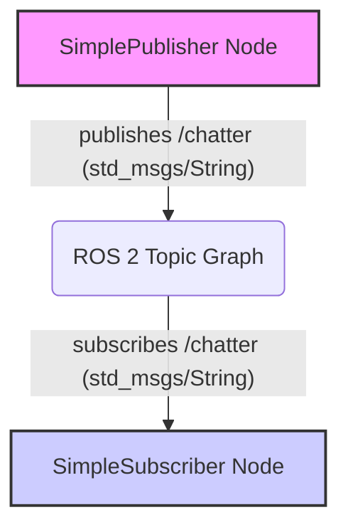

# ROS 2 Topics: Asynchronous Data Streaming

**Topics** are the most common way for nodes to exchange data in ROS 2. They implement a publish/subscribe communication model, enabling asynchronous, one-to-many data streaming. A node publishes messages to a named topic, and any other node interested in that data can subscribe to the same topic to receive those messages.

## Key Characteristics

*   **Asynchronous**: Publishers don't wait for subscribers to receive messages.
*   **One-to-Many**: A single publisher can send data to multiple subscribers.
*   **Decoupled**: Publishers and subscribers don't need to know about each other's existence, only the topic name and message type.
*   **Message Types**: Data sent over topics must conform to a predefined ROS 2 message type (e.g., `std_msgs/String`, `sensor_msgs/Image`).

## Quality of Service (QoS) Settings

ROS 2 introduces **Quality of Service (QoS)** policies, which allow you to fine-tune the reliability and behavior of topic communication. Important QoS settings include:

*   **Reliability**: `reliable` (guaranteed delivery, retransmissions) vs. `best_effort` (faster, but messages might be lost).
*   **Durability**: `transient_local` (new subscribers receive the last published message) vs. `volatile` (only receives messages published after subscription).
*   **History**: `keep_last` (only store a certain number of messages) vs. `keep_all` (store all messages).
*   **Depth**: Number of messages to store in the history buffer.

## Creating a Simple ROS 2 Subscriber (Python)

Building on our `simple_publisher` example, let's create a `simple_subscriber`.

### 1. Write the Subscriber Code (`simple_subscriber.py`)

Inside `my_robot_pkg/my_robot_pkg/`, create a file named `simple_subscriber.py`:

```python
import rclpy
from rclpy.node import Node
from std_msgs.msg import String

class SimpleSubscriber(Node):

    def __init__(self):
        super().__init__('simple_subscriber_node')
        self.subscription = self.create_subscription(
            String,
            'chatter',
            self.listener_callback,
            10) # QoS depth
        self.subscription  # prevent unused variable warning

    def listener_callback(self, msg):
        self.get_logger().info('I heard: "%s"' % msg.data)

def main(args=None):
    rclpy.init(args=args)
    simple_subscriber = SimpleSubscriber()
    rclpy.spin(simple_subscriber)
    simple_subscriber.destroy_node()
    rclpy.shutdown()

if __name__ == '__main__':
    main()
```

### 2. Update `setup.py`

Add the new executable to `my_robot_pkg/setup.py`:

```python
    entry_points={
        'console_scripts': [
            'simple_publisher = my_robot_pkg.simple_publisher:main',
            'simple_subscriber = my_robot_pkg.simple_subscriber:main',
        ],
    },
```

### 3. Build and Source

```bash
colcon build --packages-select my_robot_pkg
source install/setup.bash
```

### 4. Run Publisher and Subscriber

Open two terminals. In the first, run the publisher:

```bash
ros2 run my_robot_pkg simple_publisher
```

In the second, run the subscriber:

```bash
ros2 run my_robot_pkg simple_subscriber
```

You should see the subscriber receiving and printing the messages published by the `simple_publisher`.

## Visualizing Topic Communication



Topics are fundamental for streaming sensor data, robot states, and other continuous information. Next, we will explore **services** for request-response interactions.
